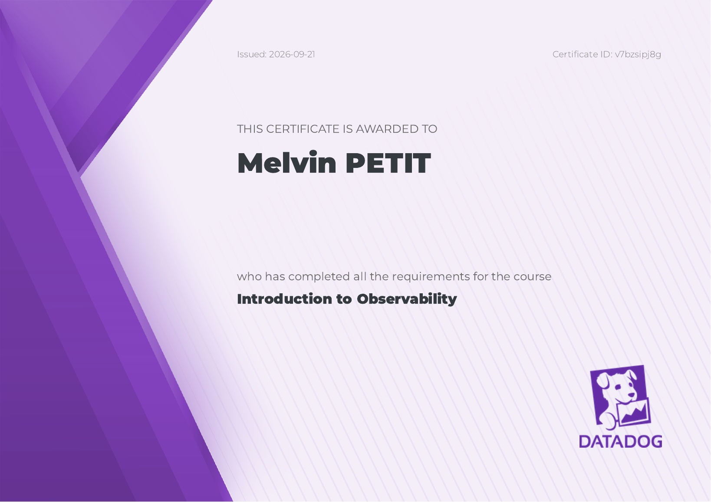
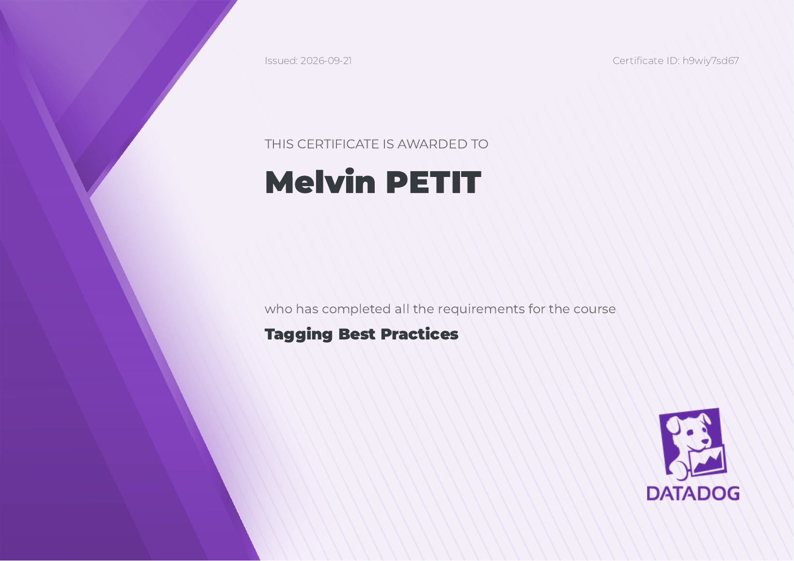

 

  

<h1 align="center">Observability Certifications</h1>

  <i>Courses completed on the <a href="https://learn.datadoghq.com/">Datadog Learning Center</a></i>

  

 

  Datadog is the tool these courses are taught with, but what they teach is not tied to it. 
  Signals, correlation and tagging work the same way behind Prometheus, Grafana or OpenTelemetry.

 

---

 

## Introduction to Observability

Metrics, logs and traces each answer a different question: how much, what exactly happened, and where the time went. This course covers why a system needs all three, and why correlating them is what turns raw telemetry into an explanation of an incident.

  

Issued 2026-09-21 &nbsp;·&nbsp; Certificate ID <code>v7bzsipj8g</code>

 

---

 

## Tagging Best Practices

Every signal carries the identity of what emitted it: environment, service, version. This course covers how a consistent set of tags lets a single query pivot from a metric to the traces and logs behind it, and why uncontrolled tag values are what makes an observability bill explode.

  

Issued 2026-09-21 &nbsp;·&nbsp; Certificate ID <code>h9wiy7sd67</code>

 

---

 

## Datadog Quick Start

Telemetry has to be collected before it can be read. This course covers the path from an agent running next to a host, a container or an application, through to the dashboards and monitors built on what it sends, the same shape of pipeline whatever the backend.

  

Issued 2026-09-21 &nbsp;·&nbsp; Certificate ID <code>vysd0lk1t6</code>

 

---

 

## The Agent on Docker

A containerised workload does not expose its telemetry the way a plain host does. This course covers running the collector as a container itself, given read access to the runtime so it discovers what is running and tags each signal with the container it came from, the pattern any node-level collector follows.

  

Issued 2026-09-21 &nbsp;·&nbsp; Certificate ID <code>x39wpllprm</code>

 

---

 

## Introduction to Dashboards

Collected telemetry is worthless until someone can read it at a glance. This course covers what belongs on a screen and what does not, and how template variables let one dashboard serve every service and environment, which only works when the signals were tagged consistently in the first place.

  

Issued 2026-09-21 &nbsp;·&nbsp; Certificate ID <code>ktcsihmhsa</code>

